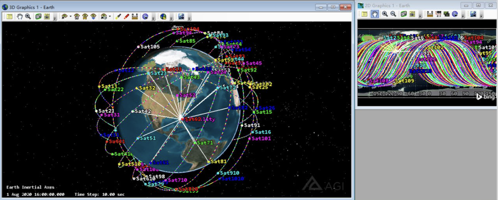

# Awesome Satellite Instances

这个仓库聚焦于无线网络与空间网络的实例，并进行分类汇总

- [SkyField](https://rhodesmill.org/skyfield/) 用于天文学计算的python库，这里展示了一些常用的样例
- [STK](https://www.ansys.com/products/missions/ansys-stk) 用于卫星网络仿真，这里展示了一些比较热门的拓扑、算法样例

笔者对于这两个工具的学习路径全部在 [Carrot-World博客](https://blog.bxhu2004.com/) 中展示，最具体、最详细的内容都在博客，此仓库只是一个汇总版

这个仓库相当于 `Cheat Sheet`，仅用于分类实例，便于未来使用 👍

## How to Install

🔥 配置 SkyField 非常简单，跟官方文档走一通即可 🔥

⚠️ 但是配置 STK 的过程非常痛苦 😅

笔者在 [Carrot-World 博客](https://blog.bxhu2004.com/) 里写了二者的详细配置教程，自顶向下，适用于新手入门

在运行本仓库实例前，请确保完全按照上述教程配置环境 🌟

## Instances

### STK

这里我们给出一些常见的 *STK仿真结果* 与 *相应的Python代码*:

**Basic Ring**

一个圆环Orbit，上面只有一个Satellite

代码: [basic-ring](./stk/basic-ring.py)

结果:

**Aviator Simulation**

航空器飞行模拟分析

代码: [aviator](./stk/aviator.py)

结果:

**8 Rings**

八个圆环Orbit，每个上面有一个Satellite

代码: [advanced-ring](./stk/advanced-ring.py)

结果:

**GS and Satellite**

> 这个例子非常非常重要 ⚠️

建立轨道、放上卫星、建立地面站(GS)、建立GS与LEO的连接、计算覆盖率

配置: 10 orbit. 10 sat/orbit

代码: [gs-sat](./stk/gs-sat.py)

结果:

**Basic StarLink**

> 非常重要 👍

建立 16x16 的 Starlink 动态网络拓扑

配置: 16 orbit shell. each shell has 16 satellites

代码: [starlink-16-16](./stk/starlink-16-16.py)

结果:

### Skyfield

TBD

